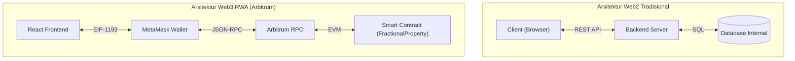
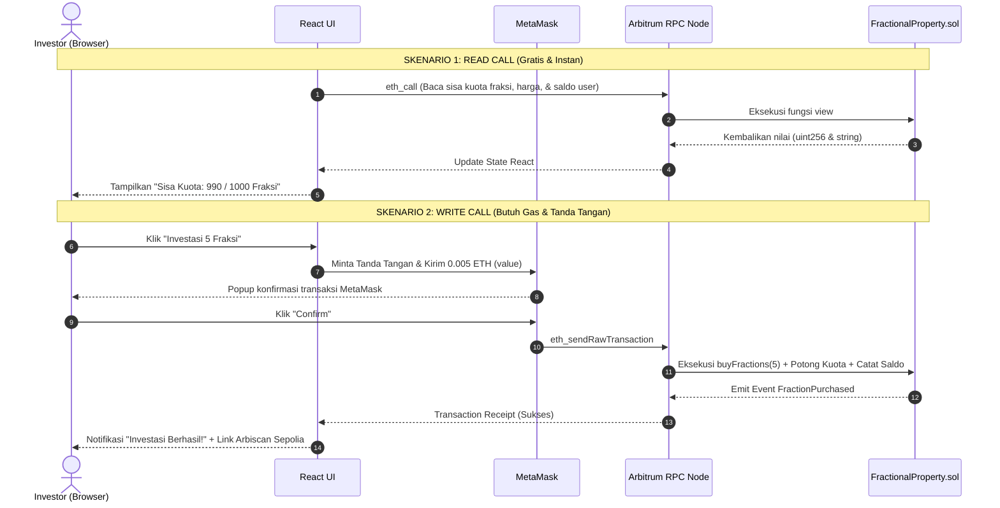

# 01. Mental Model & Arsitektur Full-Stack Web3 

---

Selamat datang di **Bagian 2: Integrasi Frontend dApp RWA di Arbitrum**! 

Pada [Bagian 1](../01-Smart-Contract/content.md), Anda telah berhasil menyusun 11 modul fondasi Solidity dan melakukan deployment smart contract Real World Asset [`FractionalProperty.sol`](../01-Smart-Contract/content.md) ke testnet **Arbitrum Sepolia**. Namun saat ini, kontrak tersebut baru bisa dioperasikan melalui tombol-tombol teknis di Remix IDE.

Hari ini, kita akan membawa kontrak tersebut ke tingkat produksi nyata: **membangun antarmuka web modern (dApp frontend) menggunakan React dan menghubungkannya langsung ke blockchain Arbitrum**.

---

## 🧠 Pergeseran Mental Model: Web2 vs Web3

Bagi pengembang web konvensional (Web2), alur kerja aplikasi umumnya berpusat pada arsitektur *Client-Server-Database*. Di dunia Web3, terutama untuk tokenisasi aset nyata (*Real World Asset*), terdapat pergeseran paradigma yang fundamental:



### Tabel Komparasi Komponen Inti RWA

| Aspek | Platform Properti Web2 | dApp RWA di Arbitrum |
| :--- | :--- | :--- |
| **Pencatatan Kepemilikan** | Tabel database SQL internal perusahaan. | Buku besar terdistribusi `mapping` di smart contract yang *immutable*. |
| **Bukti Sertifikat Fisik** | File PDF di server privat yang bisa diganti sepihak. | Hash dokumen sertifikat tanah fisik permanen di IPFS & smart contract. |
| **Identitas & Otorisasi** | Username, Password, atau token JWT. | Pasangan Kunci Kriptografi (*Private Key / Public Key* via Wallet). |
| **Penyelesaian Transaksi** | Verifikasi manual transfer bank berhari-hari. | **Sub-detik (~250ms)** di jaringan Arbitrum. |
| **Biaya Komputasi** | Ditanggung developer / cloud provider bulanan. | Ditanggung pengguna dalam bentuk **Gas Fee** (ETH) yang sangat murah di Arbitrum. |

---

## ⚡ Mengapa Arbitrum Ideal untuk dApp RWA?

Pengguna platform investasi menuntut antarmuka yang cepat, terpercaya, dan hemat biaya:

1. **Waktu Blok Sub-Detik (~250ms)**: Sequencer Arbitrum memberikan konfirmasi *soft-finality* dalam hitungan milidetik. Begitu investor menekan tombol konfirmasi di MetaMask, antarmuka React langsung menerima tanda terima transaksi (*receipt*) seketika.
2. **Biaya Gas Sangat Terjangkau**: Transaksi mikro (seperti membeli 1 fraksi properti seharga 0.001 ETH) tidak terbebani biaya gas tinggi, berbeda dengan Layer 1 yang bisa memakan biaya puluhan dolar per transaksi.
3. **EVM Equivalence Penuh**: Semua pustaka Web3 standar JavaScript (seperti `ethers.js`) bekerja 100% tanpa konfigurasi khusus selain mengarahkan RPC ke Arbitrum Sepolia.

---

## 🔄 Dua Jenis Pemanggilan: Read Calls vs Write Calls

Ketika antarmuka React Anda berinteraksi dengan smart contract `FractionalProperty.sol`, seluruh interaksi terbagi menjadi dua kategori:



### 1. Read Calls (`view` / `pure`)
- **Contoh**: Membaca fungsi `propertyName()`, `availableFractions()`, `fractionPrice()`, `propertyDocumentURI()`, atau `fractionBalances(user)`.
- **Mekanisme**: Memanfaatkan method JSON-RPC `eth_call`.
- **Karakteristik**:
  - **Gratis gas** (tidak memotong saldo ETH apa pun).
  - **Tidak memerlukan konfirmasi/tanda tangan MetaMask**.
  - Dapat dipanggil kapan saja saat komponen React pertama kali dimuat (`useEffect`).

### 2. Write Calls (`state-changing` & `payable`)
- **Contoh**: Memanggil fungsi `buyFractions(amount)` dengan menyertakan nilai ETH (`msg.value`), `restockFractions(amount)`, atau `withdrawFunds()`.
- **Mekanisme**: Memanfaatkan method JSON-RPC `eth_sendRawTransaction`.
- **Karakteristik**:
  - **Memerlukan gas fee** (dibayar dalam ETH di Arbitrum).
  - **Wajib memunculkan popup MetaMask** agar investor menyetujui transfer ETH dan menandatanganinya dengan private key mereka.
  - Memiliki siklus hidup status: *Idle* → *Waiting Wallet Confirmation* → *Pending on-chain* → *Confirmed on Arbitrum* → *Success/Revert*.

---

## 📐 Blueprint Antarmuka Platform RWA (UI First)

Pendekatan **UI First** berarti kita merancang seluruh tampilan visual, kartu status aset, dan form interaktif terlebih dahulu menggunakan mockup state sebelum menyambungkannya ke blockchain.

Berikut rancangan layout antarmuka yang akan kita bangun di modul berikutnya:

```text
┌─────────────────────────────────────────────────────────────────────────────┐
│ 🏛️ ARBITRUM RWA INVESTMENTS                        [ Connect Wallet ]       │
├─────────────────────────────────────────────────────────────────────────────┤
│                                                                             │
│  ┌───────────────────────────────┐     ┌─────────────────────────────────┐  │
│  │ 🏡 BALI SUNSET VILLA #01      │     │ 💼 PORTOFOLIO SAYA              │  │
│  │ Sisa Kuota  : 990 / 1000 Pcs  │     │ Fraksi Dimiliki : 10 Lembar     │  │
│  │ Harga/unit  : 0.001 ETH       │     │ Alamat Dompet   : 0x71C...84B   │  │
│  │ Sertifikat  : ipfs://bafy...  │     │ Status Cooldown : Siap Beli ⚡  │  │
│  └───────────────────────────────┘     └─────────────────────────────────┘  │
│                                                                             │
│  ┌───────────────────────────────────────────────────────────────────────┐  │
│  │ 🛒 INVESTASI FRAKSI PROPERTI                                          │  │
│  │ Masukkan Jumlah Fraksi: [  5  ]                                       │  │
│  │ Total Investasi       : 0.005 ETH                                     │  │
│  │                                                                       │  │
│  │ [ 🏢 Beli Fraksi Properti (Kirim Transaksi ETH) ]                     │  │
│  │                                                                       │  │
│  │ Status: Menunggu konfirmasi jaringan Arbitrum (~250ms)...             │  │
│  └───────────────────────────────────────────────────────────────────────┘  │
│                                                                             │
│  ┌ - - - - - - - - - - - - - - - - - - - - - - - - - - - - - - - - - - - ┐  │
│  │ 🔒 ASSET ISSUER DASHBOARD (Hanya Tampil Jika Terkoneksi sebagai Owner)│  │
│  │ Tambah Kuota Fraksi : [ 500 ] [ Tombol Restock ]                      │  │
│  │ Saldo Kontrak       : 0.05 ETH [ Tombol Tarik Modal / Withdraw ]      │  │
│  └ - - - - - - - - - - - - - - - - - - - - - - - - - - - - - - - - - - - ┘  │
│                                                                             │
│  ┌───────────────────────────────────────────────────────────────────────┐  │
│  │ 📜 BUKTI TRANSAKSI ON-CHAIN (ARBISCAN PROOF & LOCALSTORAGE)           │  │
│  │ • [Beli Fraksi] 10 Fraksi (0.010 ETH) | Tx: 0x3a7b...1e2f [Arbiscan ↗] │  │
│  │ • [Restock]     100 Fraksi            | Tx: 0x9c4e...8a1b [Arbiscan ↗] │  │
│  └───────────────────────────────────────────────────────────────────────┘  │
└─────────────────────────────────────────────────────────────────────────────┘
```

---

> [!TIP]
> Di [Modul 02](./02-setup-proyek-dan-ui-statis.md), kita akan langsung mempraktikkan pembuatan antarmuka RWA di atas menggunakan **Vite + React** dengan desain gelap modern bernuansa kemewahan properti dan ekosistem Arbitrum!
