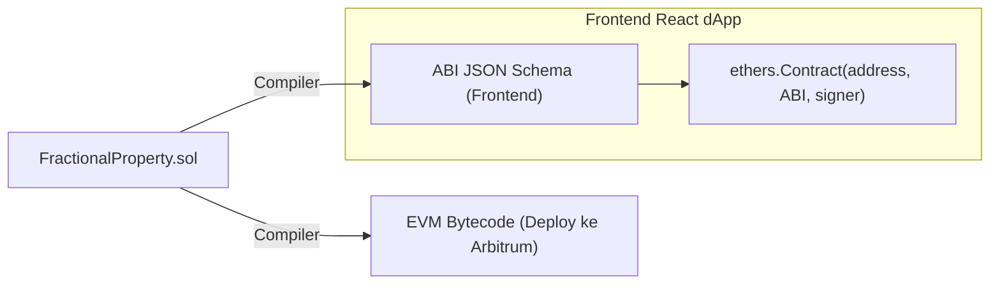

# 03. Persiapan ABI & Konfigurasi Kontrak RWA

---

Pada modul sebelumnya, antarmuka visual RWA kita masih ditenagai oleh *dummy data*. Agar antarmuka React dapat berkomunikasi langsung dengan smart contract `FractionalProperty.sol` di Arbitrum Sepolia, kita memerlukan dua hal fundamental:

1. **Alamat Kontrak (`PROPERTY_CONTRACT_ADDRESS`)**: Alamat unik smart contract properti Anda di jaringan Arbitrum Sepolia.
2. **ABI (*Application Binary Interface*)**: "Buku petunjuk" berformat JSON yang mendeskripsikan fungsi, tipe data parameter, dan event yang ada di dalam kontrak.

---

## 📖 1. Mengapa Kita Membutuhkan ABI?

Ketika smart contract Solidity dikompilasi, kode yang Anda tulis diubah menjadi deretan heksadesimal mesin yang disebut **EVM Bytecode**. EVM di Arbitrum mengeksekusi bytecode ini secara efisien, namun JavaScript di browser tidak memahami arti bita mesin tersebut tanpa skema terjemahan.



**Fungsi ABI dalam dApp RWA**:
- Memberitahu `ethers.js` bahwa fungsi `buyFractions(uint256 _amount)` menerima satu argumen angka bulat (`uint256`) dan bersifat `payable` (dapat menerima nilai ETH).
- Menginstruksikan format pemanggilan fungsi *read* seperti `propertyName()`, `availableFractions()`, dan `propertyDocumentURI()`.
- Mendekode data event blockchain seperti `FractionPurchased` agar dapat ditangkap oleh antarmuka secara real-time.

---

## 📋 2. Cara Mengambil ABI dari Remix IDE

Jika Anda telah menyelesaikan [Bagian 1](../01-Smart-Contract/content.md), Anda dapat mengambil ABI kontrak Anda secara instan dari Remix IDE:

1. Buka kembali [Remix IDE](https://remix.ethereum.org).
2. Di panel sebelah kiri, buka tab **Solidity Compiler** (ikon berlogo Solidity bergambar huruf "S").
3. Pastikan file kontrak `FractionalProperty.sol` terpilih dan klik tombol **Compile FractionalProperty.sol**.
4. Gulir ke bagian paling bawah panel compiler.
5. Anda akan menemukan tombol bertuliskan **ABI** dengan ikon salin (*copy*). Klik tombol tersebut untuk menyalin seluruh objek JSON ABI ke clipboard Anda.

> [!NOTE]
> Alamat kontrak (*Contract Address*) bisa Anda temukan di tab **Deploy & Run Transactions** pada bagian *Deployed Contracts*, atau dari riwayat transaksi deploy Anda di [Arbiscan Sepolia](https://sepolia.arbiscan.io).

---

## ⚙️ 3. Membuat File Konfigurasi (`src/constants/contract.js`)

Pastikan direktori `src/constants/` sudah tersedia (buat dengan `mkdir -p src/constants` jika belum ada), lalu buat file baru pada path `src/constants/contract.js`.

Salin kode konfigurasi berikut:

```javascript
// -------------------------------------------------------------
// 1. ALAMAT SMART CONTRACT RWA
// Ganti nilai string di bawah ini dengan alamat kontrak hasil deploy Bagian 1 Anda!
// -------------------------------------------------------------
export const PROPERTY_CONTRACT_ADDRESS = "0x0000000000000000000000000000000000000000"; 

// -------------------------------------------------------------
// 2. PARAMETER JARINGAN ARBITRUM SEPOLIA (EIP-3085)
// Digunakan untuk meminta MetaMask beralih/menambahkan jaringan secara otomatis
// -------------------------------------------------------------
export const ARBITRUM_SEPOLIA_CHAIN_ID = 421614;
export const ARBITRUM_SEPOLIA_HEX_ID = "0x66eee"; // 421614 dalam format heksadesimal

export const ARBITRUM_SEPOLIA_NETWORK_PARAMS = {
  chainId: ARBITRUM_SEPOLIA_HEX_ID,
  chainName: "Arbitrum Sepolia Testnet",
  nativeCurrency: {
    name: "Ethereum",
    symbol: "ETH",
    decimals: 18
  },
  rpcUrls: ["https://sepolia-rollup.arbitrum.io/rpc"],
  blockExplorerUrls: ["https://sepolia.arbiscan.io"]
};

// -------------------------------------------------------------
// 3. APPLICATION BINARY INTERFACE (ABI)
// Mencakup seluruh fungsi dan event dari FractionalProperty.sol
// -------------------------------------------------------------
export const FRACTIONAL_PROPERTY_ABI = [
  {
    "inputs": [],
    "stateMutability": "nonpayable",
    "type": "constructor"
  },
  {
    "anonymous": false,
    "inputs": [
      {
        "indexed": true,
        "internalType": "address",
        "name": "investor",
        "type": "address"
      },
      {
        "indexed": false,
        "internalType": "uint256",
        "name": "amount",
        "type": "uint256"
      },
      {
        "indexed": false,
        "internalType": "uint256",
        "name": "totalCost",
        "type": "uint256"
      },
      {
        "indexed": false,
        "internalType": "uint256",
        "name": "remainingFractions",
        "type": "uint256"
      },
      {
        "indexed": false,
        "internalType": "uint256",
        "name": "timestamp",
        "type": "uint256"
      }
    ],
    "name": "FractionPurchased",
    "type": "event"
  },
  {
    "anonymous": false,
    "inputs": [
      {
        "indexed": false,
        "internalType": "uint256",
        "name": "additionalFractions",
        "type": "uint256"
      },
      {
        "indexed": false,
        "internalType": "uint256",
        "name": "newAvailableFractions",
        "type": "uint256"
      },
      {
        "indexed": false,
        "internalType": "uint256",
        "name": "timestamp",
        "type": "uint256"
      }
    ],
    "name": "FractionsRestocked",
    "type": "event"
  },
  {
    "anonymous": false,
    "inputs": [
      {
        "indexed": true,
        "internalType": "address",
        "name": "owner",
        "type": "address"
      },
      {
        "indexed": false,
        "internalType": "uint256",
        "name": "amount",
        "type": "uint256"
      },
      {
        "indexed": false,
        "internalType": "uint256",
        "name": "timestamp",
        "type": "uint256"
      }
    ],
    "name": "FundsWithdrawn",
    "type": "event"
  },
  {
    "inputs": [],
    "name": "COOLDOWN_PERIOD",
    "outputs": [
      {
        "internalType": "uint256",
        "name": "",
        "type": "uint256"
      }
    ],
    "stateMutability": "view",
    "type": "function"
  },
  {
    "inputs": [],
    "name": "availableFractions",
    "outputs": [
      {
        "internalType": "uint256",
        "name": "",
        "type": "uint256"
      }
    ],
    "stateMutability": "view",
    "type": "function"
  },
  {
    "inputs": [
      {
        "internalType": "uint256",
        "name": "_amount",
        "type": "uint256"
      }
    ],
    "name": "buyFractions",
    "outputs": [],
    "stateMutability": "payable",
    "type": "function"
  },
  {
    "inputs": [
      {
        "internalType": "address",
        "name": "",
        "type": "address"
      }
    ],
    "name": "fractionBalances",
    "outputs": [
      {
        "internalType": "uint256",
        "name": "",
        "type": "uint256"
      }
    ],
    "stateMutability": "view",
    "type": "function"
  },
  {
    "inputs": [],
    "name": "fractionPrice",
    "outputs": [
      {
        "internalType": "uint256",
        "name": "",
        "type": "uint256"
      }
    ],
    "stateMutability": "view",
    "type": "function"
  },
  {
    "inputs": [
      {
        "internalType": "address",
        "name": "_investor",
        "type": "address"
      }
    ],
    "name": "getInvestorFractions",
    "outputs": [
      {
        "internalType": "uint256",
        "name": "",
        "type": "uint256"
      }
    ],
    "stateMutability": "view",
    "type": "function"
  },
  {
    "inputs": [],
    "name": "getMyFractions",
    "outputs": [
      {
        "internalType": "uint256",
        "name": "",
        "type": "uint256"
      }
    ],
    "stateMutability": "view",
    "type": "function"
  },
  {
    "inputs": [
      {
        "internalType": "address",
        "name": "",
        "type": "address"
      }
    ],
    "name": "lastInvestmentTime",
    "outputs": [
      {
        "internalType": "uint256",
        "name": "",
        "type": "uint256"
      }
    ],
    "stateMutability": "view",
    "type": "function"
  },
  {
    "inputs": [],
    "name": "owner",
    "outputs": [
      {
        "internalType": "address",
        "name": "",
        "type": "address"
      }
    ],
    "stateMutability": "view",
    "type": "function"
  },
  {
    "inputs": [],
    "name": "propertyDocumentURI",
    "outputs": [
      {
        "internalType": "string",
        "name": "",
        "type": "string"
      }
    ],
    "stateMutability": "view",
    "type": "function"
  },
  {
    "inputs": [],
    "name": "propertyName",
    "outputs": [
      {
        "internalType": "string",
        "name": "",
        "type": "string"
      }
    ],
    "stateMutability": "view",
    "type": "function"
  },
  {
    "inputs": [],
    "name": "propertySymbol",
    "outputs": [
      {
        "internalType": "string",
        "name": "",
        "type": "string"
      }
    ],
    "stateMutability": "view",
    "type": "function"
  },
  {
    "inputs": [
      {
        "internalType": "uint256",
        "name": "_additionalFractions",
        "type": "uint256"
      }
    ],
    "name": "restockFractions",
    "outputs": [],
    "stateMutability": "nonpayable",
    "type": "function"
  },
  {
    "inputs": [],
    "name": "totalFractions",
    "outputs": [
      {
        "internalType": "uint256",
        "name": "",
        "type": "uint256"
      }
    ],
    "stateMutability": "view",
    "type": "function"
  },
  {
    "inputs": [],
    "name": "withdrawFunds",
    "outputs": [],
    "stateMutability": "nonpayable",
    "type": "function"
  }
];
```

---

## 🔍 Checklist Verifikasi Konfigurasi

Sebelum melanjutkan ke integrasi kode Web3 di modul berikutnya, pastikan:
- [ ] Anda telah mengganti `PROPERTY_CONTRACT_ADDRESS` dengan alamat kontrak asli Anda di Arbitrum Sepolia.
- [ ] Objek `FRACTIONAL_PROPERTY_ABI` memuat fungsi-fungsi utama: `buyFractions`, `getMyFractions`, `availableFractions`, `fractionPrice`, `propertyDocumentURI`, `restockFractions`, dan `withdrawFunds`.
- [ ] Parameter Chain ID diisi dengan benar: angka desimal `421614` dan string heksadesimal `0x66eee`.

> [!TIP]
> Di [Modul 04](./04-integrasi-web3-step-by-step.md), kita akan menghubungkan file konfigurasi ini ke komponen React menggunakan pustaka `ethers.js` v6!
