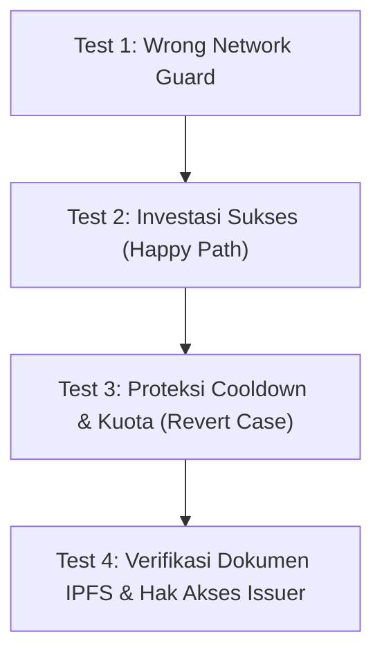

# 05. Testing End-to-End & Deployment ke Web Publik

---

Selamat! Anda telah berhasil merakit seluruh arsitektur frontend dApp terdesentralisasi untuk platform **RWA Fractional Real Estate (Bali Sunset Villa #01)** menggunakan **React**, **Ethers.js v6**, dan **Arbitrum Sepolia**. 

Sebelum membagikan dApp ini kepada para investor dan publik, kita perlu melakukan pengujian skenario menyeluruh (*End-to-End Testing*) dan mempublikasikannya ke hosting web publik.

---

## 🧪 1. Matriks Pengujian End-to-End (E2E)

Jalankan server pengembangan lokal Anda (`npm run dev`) dan lakukan 4 skenario pengujian berikut secara berurutan:

<div className="mermaid-test-matrix">



</div>

### Skenario 1: Deteksi Jaringan Salah (*Wrong Network Guard*)
- **Langkah**: Buka MetaMask dan sengaja alihkan jaringan ke *Ethereum Mainnet* atau *Sepolia L1*.
- **Tindakan**: Buka aplikasi web dApp Anda di browser dan klik tombol **Connect Wallet**.
- **Ekspektasi**: MetaMask otomatis memunculkan prompt konfirmasi untuk beralih (*switch*) atau mendaftarkan jaringan **Arbitrum Sepolia** (Chain ID: `421614` / `0x66eee`).
- **Hasil**: ✅ Berhasil jika antarmuka hanya dapat berinteraksi ketika berada di jaringan Arbitrum Sepolia.

---

### Skenario 2: Investasi Sukses (*Happy Path*)
- **Langkah**: Hubungkan akun MetaMask yang memiliki saldo Arbitrum Sepolia ETH (gunakan akun investor, bukan akun Issuer/Owner).
- **Tindakan**: Masukkan jumlah `2` unit fraksi, lalu klik tombol **Konfirmasi & Beli (2 Lembar Fraksi)**.
- **Ekspektasi**:
  1. Popup MetaMask meminta konfirmasi transfer `0.002 ETH` (2 × 0.001 ETH) + estimasi gas fee Arbitrum yang sangat terjangkau (~0.00002 ETH).
  2. Tombol UI beralih ke indikator *Loading* (*Memproses Investasi di Arbitrum...*).
  3. Dalam hitungan detik (~250ms - 1 detik), banner sukses hijau muncul disertai tautan transaksi ke **Arbiscan Sepolia**.
  4. Sisa kuota fraksi properti berkurang 2, dan portofolio kepemilikan Anda bertambah 2 lembar.
- **Hasil**: ✅ Berhasil jika data blockchain dan tampilan antarmuka tersinkronisasi seketika.

---

### Skenario 3: Penanganan Revert Cooldown & Kuota (*Error Handling*)
- **Langkah**: Tepat setelah transaksi pada Skenario 2 berhasil, langsung coba lakukan pembelian fraksi lagi tanpa menunggu 10 detik.
- **Tindakan**: Konfirmasi transaksi di MetaMask.
- **Ekspektasi**: Transaksi ditolak atau direvert oleh smart contract karena aturan `block.timestamp - lastInvestmentTime[msg.sender] < COOLDOWN_PERIOD`.
- **Hasil**: ✅ Antarmuka menampilkan banner merah bertuliskan pesan revert ramah (*"Gagal: Cooldown masih aktif. Silakan tunggu beberapa detik"*), dan aplikasi tidak mengalami *crash*.

---

### Skenario 4: Verifikasi Dokumen IPFS & Hak Akses Issuer (*Security & Compliance*)
- **Langkah**: 
  1. Klik tautan **Verifikasi On-Chain** di samping label *Sertifikat BPN Legal*. Periksa apakah link IPFS membuka dokumen legalitas properti dengan benar (membuka file legalitas resmi workshop dengan CID `bafybeiexwukp7b44s42dk7fjybeduq4teqganfsmndrpxmr6im32meru3i`).
  2. Beralih akun di MetaMask ke akun yang Anda gunakan saat men-deploy kontrak di Bagian 1 (*Deployer / Asset Issuer*).
- **Ekspektasi**:
  1. Antarmuka mendeteksi `account.toLowerCase() === owner.toLowerCase()`.
  2. Kartu emas **Asset Issuer Dashboard** otomatis terbuka di bagian bawah.
  3. Coba lakukan **Tambah Kuota**: Masukkan angka 100 → kuota fraksi penawaran bertambah 100.
  4. Coba lakukan **Tarik Modal Investasi**: Seluruh saldo ETH hasil penjualan fraksi di dalam kontrak dicairkan ke dompet pengelola Anda.
- **Hasil**: ✅ Berhasil jika fungsi manajerial hanya dapat diakses dan dieksekusi oleh pengelola sah.

---

## 🌐 2. Deployment Frontend ke Vercel (Gratis & Cepat)

Cara termudah dan paling standar di industri Web3 untuk mempublikasikan antarmuka dApp adalah menggunakan platform hosting **Vercel**.

### Langkah 1: Buat Bundle Produksi
Uji apakah seluruh kode React Anda berhasil di-build tanpa error:

```bash
npm run build
```

Perintah ini akan memvalidasi sintaks JSX dan menghasilkan folder `dist/` yang siap dideploy.

### Langkah 2: Deploy Menggunakan Vercel CLI

```bash
# Pasang Vercel CLI (jika belum ada)
npm install -g vercel

# Jalankan proses deployment
vercel
```

Ikuti panduan interaktif di terminal:
- `Set up and deploy?` → Tekan **y**
- `Which scope?` → Pilih akun personal Anda
- `Link to existing project?` → Tekan **n**
- `What's your project's name?` → `arbitrum-rwa-property`
- `In which directory is your code located?` → `./`
- `Want to modify these settings?` → Tekan **n**

Dalam ~30 detik, terminal akan memberikan URL produksi publik Anda (misalnya: `https://arbitrum-rwa-property.vercel.app`).

> [!TIP]
> Anda juga dapat menghubungkan repositori GitHub Anda langsung ke dashboard [vercel.com](https://vercel.com) untuk mengaktifkan *Continuous Deployment* (setiap kali Anda melakukan `git push`, website akan diperbarui secara otomatis).

---

## 🎉 Rangkuman Pencapaian Workshop

Luar biasa! Dalam rangkaian workshop ini, Anda telah menyelesaikan seluruh siklus pengembangan aplikasi Web3 terdesentralisasi:

```text
[Bagian 1: Lapisan Smart Contract RWA]
 ├── 11 Modul Fondasi Solidity (String, Numbers, Visibility, Functions, Mapping,
 │                             msg.sender, Timestamp, Payable, Require, Events, Owner)
 └── Deployment FractionalProperty.sol ke Arbitrum Sepolia via Remix IDE

                 ⬇️ TERHUBUNG PENUH DENGAN ⬇️

[Bagian 2: Lapisan Integrasi Frontend dApp]
 ├── Arsitektur dApp Web3 & Mental Model Tokenisasi Aset (RWA)
 ├── Antarmuka Visual Modern (UI-First Approach dengan Glassmorphism & Cyber-Slate)
 ├── Konfigurasi ABI & Auto-Switch Jaringan Arbitrum Sepolia (Chain ID: 421614)
 ├── Pembacaan Data On-Chain & Eksekusi Pembayaran Investasi dengan ETH
 ├── Kontrol Akses Kondisional Pengelola Aset (Issuer Dashboard)
 ├── Penanganan Real-time Event Listener (FractionPurchased & FractionsRestocked)
 └── Pengujian End-to-End & Publikasi ke Vercel
```

Anda kini telah memiliki aplikasi terdesentralisasi (*dApp*) Real World Asset yang berfungsi penuh, aman, transparan, dan siap dipamerkan di portofolio Web3 Anda! 🚀
