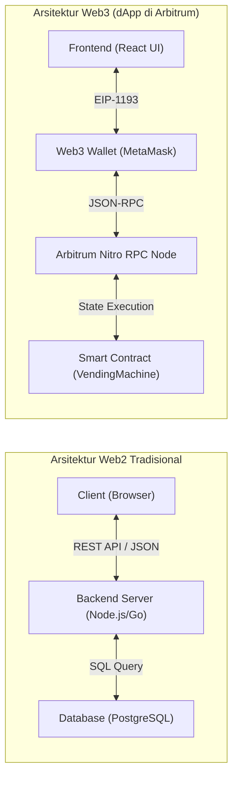
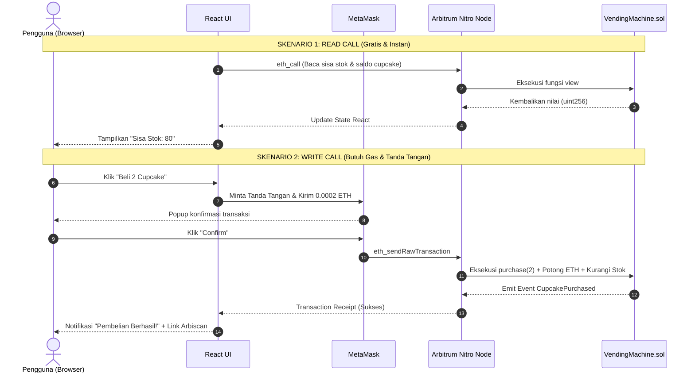

# 01. Mental Model & Arsitektur Full-Stack Web3

---

Selamat datang di **Day 2: Integrasi Frontend dApp di Arbitrum**! 

Pada [Day 1](../Day-1/content.md), Anda telah berhasil menyusun, menguji 10 modul fondasi Solidity, dan melakukan deployment smart contract `VendingMachine.sol` ke testnet **Arbitrum Sepolia**. Namun saat ini, smart contract tersebut baru bisa dioperasikan melalui panel tombol Remix IDE.

Hari ini, kita akan membawa kontrak tersebut ke tingkat produksi: **membangun antarmuka web modern (dApp frontend) menggunakan React dan menghubungkannya langsung ke blockchain Arbitrum**.

---

## 🧠 Pergeseran Mental Model: Web2 vs Web3

Bagi pengembang web konvensional (Web2), alur kerja aplikasi umumnya berpusat pada arsitektur *Client-Server-Database*. Di dunia Web3, terdapat pergeseran paradigma yang sangat fundamental:



### Tabel Komparasi Komponen Inti

| Aspek | Web2 Tradisional | Web3 dApp (Arbitrum) |
| :--- | :--- | :--- |
| **Penyimpan Status (State)** | Database terpusat (MySQL, PostgreSQL, MongoDB). | Ledger terdistribusi Arbitrum (State Variables di kontrak). |
| **Logika Bisnis (Backend)** | Server backend API (Express, NestJS, Django, Go). | Smart Contract Solidity yang bersifat *immutable* di EVM. |
| **Identitas & Autentikasi** | Email/Password, JWT token, OAuth (Google/GitHub). | Pasangan Kunci Kriptografi (*Private Key / Public Key* via Wallet). |
| **Otorisasi Aksi** | Sesi Cookie atau Header `Authorization: Bearer <token>`. | Tanda tangan digital kriptografis (*Cryptographic Signature*). |
| **Biaya Komputasi** | Ditanggung oleh pemilik server / cloud provider. | Ditanggung oleh pengguna dalam bentuk **Gas Fee** (ETH). |

---

## ⚡ Mengapa Arbitrum Nitro Ideal untuk Antarmuka Web3?

Salah satu tantangan terbesar antarmuka Web3 di Ethereum Layer 1 adalah **latensi konfirmasi transaksi** (~12 detik per blok) dan **biaya gas yang fluktuatif**. Pengguna web modern terbiasa dengan responsivitas instan.

Arbitrum memecahkan tantangan ini melalui arsitektur **Arbitrum Nitro**:
1. **Waktu Blok Sub-Detik (~250ms)**: Sequencer Arbitrum memberikan konfirmasi *soft-finality* dalam hitungan milidetik. Begitu pengguna menekan tombol konfirmasi di MetaMask, antarmuka React Anda dapat langsung menerima konfirmasi blok hampir seketika.
2. **Biaya Gas Sangat Terjangkau**: Transaksi di Arbitrum Sepolia dan Arbitrum One berbiaya hingga puluhan kali lebih murah dibandingkan Ethereum Mainnet, memungkinkan eksekusi transaksi mikro seperti pembelian makanan ringan di Vending Machine kita.
3. **EVM Equivalence Penuh**: Semua pustaka Web3 standar JavaScript (seperti `ethers.js` atau `viem`) bekerja 100% tanpa perlu konfigurasi khusus selain mengarahkan RPC ke Arbitrum.

---

## 🔄 Dua Jenis Pemanggilan: Read Calls vs Write Calls

Ketika antarmuka React Anda berinteraksi dengan smart contract `VendingMachine.sol`, seluruh interaksi terbagi menjadi dua kategori utama:



### 1. Read Calls (`view` / `pure`)
- **Contoh**: Membaca fungsi `cupcakeBalances(user)`, `owner()`, atau harga `CUPCAKE_PRICE`.
- **Mekanisme**: Memanfaatkan method JSON-RPC `eth_call`.
- **Karakteristik**:
  - **Gratis gas** (tidak memotong saldo ETH apa pun).
  - **Tidak memerlukan konfirmasi/tanda tangan MetaMask**.
  - Sangat cepat dan dapat dipanggil kapan saja saat komponen React pertama kali dimuat (`useEffect`).

### 2. Write Calls (`state-changing` & `payable`)
- **Contoh**: Memanggil fungsi `purchase(amount)` dengan menyertakan sejumlah ETH, `refill(amount)`, atau `withdraw()`.
- **Mekanisme**: Memanfaatkan method JSON-RPC `eth_sendRawTransaction`.
- **Karakteristik**:
  - **Memerlukan gas fee** (dibayar dalam ETH di Arbitrum).
  - **Wajib memunculkan popup MetaMask** agar pengguna menyetujui transaksi dan menandatanganinya dengan private key mereka.
  - Memiliki siklus hidup status: *Idle* $\to$ *Waiting Wallet Confirmation* $\to$ *Pending on-chain* $\to$ *Confirmed on Arbitrum* $\to$ *Success/Revert*.

---

## 📐 Blueprint Antarmuka Vending Machine (UI First)

Pendekatan **UI First** berarti kita merancang dan membangun seluruh tata letak visual, state komponen, serta penanganan feedback pengguna terlebih dahulu sebelum mengaitkannya ke blockchain.

Berikut rancangan layout antarmuka yang akan kita bangun di modul berikutnya:

```text
┌─────────────────────────────────────────────────────────────────────────────┐
│ 🧁 ARBITRUM VENDING MACHINE dAPP                   [ Connect Wallet ]       │
├─────────────────────────────────────────────────────────────────────────────┤
│                                                                             │
│  ┌───────────────────────────────┐     ┌─────────────────────────────────┐  │
│  │ 🏪 STATUS VENDING MACHINE     │     │ 🎒 INVENTORY SAYA               │  │
│  │ Sisa Stok  : 80 Cupcakes      │     │ Cupcake Dimiliki : 3 Pcs        │  │
│  │ Harga/pcs  : 0.0001 ETH       │     │ Alamat Dompet    : 0x71C...84B  │  │
│  │ Jaringan   : Arbitrum Sepolia │     │ Status Cooldown  : Siap Beli    │  │
│  └───────────────────────────────┘     └─────────────────────────────────┘  │
│                                                                             │
│  ┌───────────────────────────────────────────────────────────────────────┐  │
│  │ 🛒 BELI CUPCAKE                                                       │  │
│  │ Masukkan Jumlah: [  2  ]                                              │  │
│  │ Total Pembayaran: 0.0002 ETH                                          │  │
│  │                                                                       │  │
│  │ [ 🧁 Konfirmasi & Beli Cupcake ]                                      │  │
│  │                                                                       │  │
│  │ Status: Menunggu konfirmasi jaringan Arbitrum (~250ms)...             │  │
│  └───────────────────────────────────────────────────────────────────────┘  │
│                                                                             │
│  ┌ - - - - - - - - - - - - - - - - - - - - - - - - - - - - - - - - - - - ┐  │
│  │ 🔒 OWNER CONTROLS (Hanya Tampil Jika Terkoneksi sebagai Pemilik)      │  │
│  │ Isi Ulang Stok : [ 50 ] [ Tombol Refill ]                             │  │
│  │ Saldo Kontrak  : 0.05 ETH [ Tombol Tarik Dana / Withdraw ]            │  │
│  └ - - - - - - - - - - - - - - - - - - - - - - - - - - - - - - - - - - - ┘  │
└─────────────────────────────────────────────────────────────────────────────┘
```

---

> [!TIP]
> Di [Modul 02](./02-setup-proyek-dan-ui-statis.md), kita akan langsung mempraktikkan inisialisasi proyek menggunakan **Vite + React** dan merakit antarmuka di atas secara visual menggunakan styling modern bertema ekosistem Arbitrum!
