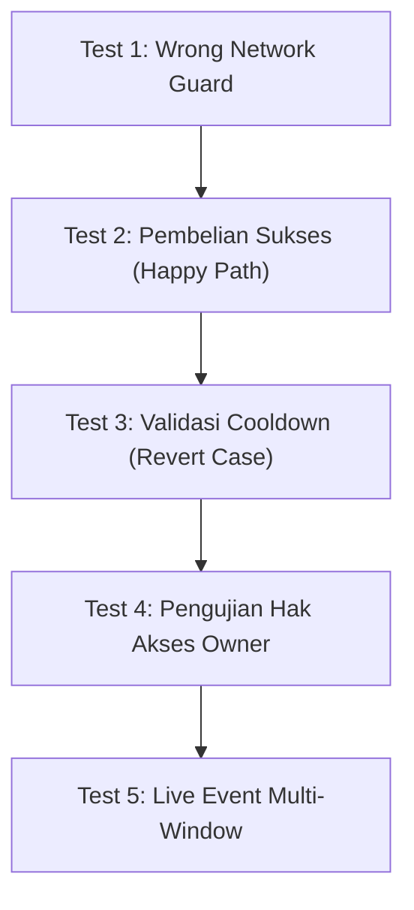

# 05. Testing End-to-End & Deployment ke Web Publik

---

Selamat! Anda telah merakit seluruh arsitektur frontend dApp terdesentralisasi menggunakan **React** dan **Arbitrum Sepolia**. 

Sebelum membagikan dApp ini ke publik, kita perlu melakukan pengujian skenario menyeluruh (*End-to-End Testing*) dan menyiapkan proses deployment ke hosting publik.

---

## 🧪 1. Matriks Pengujian End-to-End (E2E)

Jalankan server pengembangan Anda (`npm run dev`) dan lakukan 5 skenario pengujian berikut:



### Skenario 1: Deteksi Jaringan Salah (*Wrong Network Guard*)
- **Langkah**: Buka MetaMask dan sengaja alihkan jaringan ke *Ethereum Mainnet* atau *Sepolia L1*.
- **Tindakan**: Buka dApp Anda dan klik tombol **Connect Wallet**.
- **Ekspektasi**: MetaMask memunculkan prompt konfirmasi untuk secara otomatis beralih (*switch*) atau menambahkan jaringan **Arbitrum Sepolia** (Chain ID: `421614`).
- **Hasil**: ✅ Berhasil jika antarmuka hanya dapat berinteraksi ketika berada di Arbitrum Sepolia.

---

### Skenario 2: Pembelian Sukses (*Happy Path*)
- **Langkah**: Hubungkan akun MetaMask yang memiliki saldo testnet Sepolia ETH (bukan akun Owner).
- **Tindakan**: Masukkan kuantitas `2` cupcake, lalu klik tombol **Konfirmasi & Beli Cupcake**.
- **Ekspektasi**:
  1. Popup MetaMask meminta konfirmasi pengiriman `0.0002 ETH` + estimasi gas fee Arbitrum yang sangat kecil (~0.00002 ETH).
  2. Tombol UI beralih ke state *Loading*.
  3. Dalam hitungan detik (~250ms - 1 detik), banner sukses hijau muncul disertai tautan ke **Arbiscan Sepolia**.
  4. Sisa stok berkurang 2, dan inventory cupcake dompet Anda bertambah 2.
- **Hasil**: ✅ Berhasil jika data blockchain dan UI tersinkronisasi sempurna.

---

### Skenario 3: Penanganan Revert Cooldown (*Error Handling*)
- **Langkah**: Tepat setelah pembelian di Skenario 2 berhasil, langsung tekan tombol beli lagi tanpa menunggu.
- **Tindakan**: Konfirmasi transaksi di MetaMask.
- **Ekspektasi**: Transaksi ditolak/direvert oleh smart contract karena aturan `block.timestamp - lastPurchaseTimestamp[msg.sender] < COOLDOWN_PERIOD`.
- **Hasil**: ✅ Antarmuka menampilkan banner merah bertuliskan pesan revert yang ramah pengguna (*"Gagal: Cooldown masih aktif. Silakan tunggu beberapa saat"*), dan aplikasi tidak mengalami *crash*.

---

### Skenario 4: Pengujian Hak Akses Owner (*Role-Based Security*)
- **Langkah**: Beralih akun di MetaMask ke akun yang Anda gunakan saat men-deploy kontrak di Day 1.
- **Ekspektasi**:
  1. Antarmuka mendeteksi `account.toLowerCase() === owner.toLowerCase()`.
  2. Kartu emas **Owner Dashboard** langsung terbuka di bagian bawah.
  3. Coba lakukan **Refill Stok**: Masukkan angka 50 $\to$ stok mesin bertambah 50.
  4. Coba lakukan **Withdraw**: Saldo ETH hasil penjualan di dalam kontrak ditransfer ke dompet Anda.
- **Hasil**: ✅ Berhasil jika fitur admin hanya dapat diakses dan dieksekusi oleh owner sah.

---

### Skenario 5: Propagasi Real-time Event (*Multi-Window Sync*)
- **Langkah**: Buka dApp Anda di dua jendela browser berdampingan (Window A dan Window B).
- **Tindakan**: Lakukan pembelian di Window A.
- **Ekspektasi**: Window B (yang tidak melakukan apa-apa) otomatis meng-update angka sisa stok mesin seketika setelah event `CupcakePurchased` tertangkap oleh listener.
- **Hasil**: ✅ Berhasil tanpa memerlukan reload halaman manual!

---

## 🌐 2. Deployment Frontend ke Vercel (Gratis & Cepat)

Cara termudah dan paling standar untuk mempublikasikan antarmuka dApp adalah menggunakan platform hosting **Vercel**.

### Langkah 1: Buat Bundle Produksi
Uji apakah kode React Anda berhasil di-build tanpa error sintaks:

```bash
npm run build
```

Perintah ini akan menghasilkan folder `dist/` yang siap dideploy.

### Langkah 2: Deploy Menggunakan Vercel CLI

```bash
# Pasang Vercel CLI (jika belum ada)
npm install -g vercel

# Jalankan proses deployment
vercel
```

Ikuti panduan interaktif di terminal:
- `Set up and deploy?` $\to$ Tekan **y**
- `Which scope?` $\to$ Pilih akun personal Anda
- `Link to existing project?` $\to$ Tekan **n**
- `What's your project's name?` $\to$ `arbitrum-vending-machine`
- `In which directory is your code located?` $\to$ `./`
- `Want to modify these settings?` $\to$ Tekan **n**

Dalam ~30 detik, terminal akan memberikan URL produksi publik Anda (misalnya: `https://arbitrum-vending-machine.vercel.app`).

> [!TIP]
> Anda juga dapat menghubungkan repository GitHub Anda langsung ke dashboard [vercel.com](https://vercel.com) untuk mengaktifkan *Continuous Deployment* (setiap kali Anda melakukan `git push`, website akan diperbarui secara otomatis).

---

## 🛡️ 3. Praktik Keamanan Terbaik untuk Frontend Web3

Sebelum merilis dApp ke mainnet di masa depan, ingat prinsip-prinsip krusial berikut:

1. **Jangan Pernah Menyimpan Private Key di Frontend**:
   Semua penandatanganan transaksi wajib didelegasikan ke wallet pengguna (MetaMask) melalui `provider.getSigner()`. File `.env` frontend tidak boleh memuat private key apa pun.
2. **Validasi State di Smart Contract, Bukan Hanya di UI**:
   Pengguna jahat bisa memanggil smart contract secara langsung tanpa melewati antarmuka web Anda. Oleh karena itu, batasan seperti saldo, kepemilikan, dan cooldown wajib dilindungi oleh `require()` di Solidity (seperti yang telah kita bangun di Day 1).
3. **Format Data BigInt Secara Hati-Hati**:
   Satuan mata uang di EVM (Wei) memiliki 18 desimal dan melampaui batas angka aman JavaScript (`Number.MAX_SAFE_INTEGER`). Selalu gunakan `BigInt` dan utilitas bawaan pustaka Web3 seperti `ethers.formatEther` dan `ethers.parseEther`.

---

## 🎉 Rangkuman Pencapaian Workshop

Luar biasa! Dalam rangkaian workshop ini, Anda telah menyelesaikan perjalanan komprehensif dari nol hingga mahir:

```text
[Day 1: Smart Contract Layer]
 ├── 10 Modul Fondasi Solidity (String, Numbers, Visibility, Functions, Mapping,
 │                             msg.sender, Timestamp, Require, Events, Owner)
 └── Deployment VendingMachine.sol ke Arbitrum Sepolia via Remix & Foundry

                 ⬇️ TERHUBUNG PENUH DENGAN ⬇️

[Day 2: Full-Stack Integration Layer]
 ├── Pergeseran Paradigma & Arsitektur dApp Web3
 ├── Pembangunan Antarmuka Visual Modern (UI First Approach)
 ├── Konfigurasi ABI & Auto-Switch Chain ID 421614
 ├── Pembacaan Data On-Chain & Transaksi Pembayaran ETH
 ├── Kontrol Akses Kondisional (Owner Dashboard)
 ├── Penanganan Real-time Event Listener
 └── Pengujian End-to-End & Publikasi ke Vercel
```

Anda kini telah memiliki aplikasi terdesentralisasi (*dApp*) yang berfungsi penuh, aman, dan siap dipamerkan di portofolio Web3 Anda! 🚀
